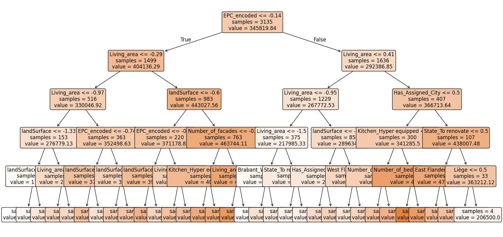

# immo-eliza-ml


# 🏢 Description

In this project, Machine Learning is used to predict prices of Belgian Houses.  
For this, relevant data was scraped from immoweb.be, cleaned and analyzed in previous project step. 
 The choice of the models tested below is also based on the findings presented in the previous project step.
 Only some preprocessing was altered for the categorical data. 
(https://github.com/IzaMacBor/immo-eliza-team6-analysis)

# 📦 Repo structure 

```
  .venv
  catboost_info
  .gitignore
  ML CatBoost.ipynb
  ML DT.ipynb
  ML lasso.ipynb
  ML LR.ipynb
  ML LR_m2_without_std.ipynb
  ML LR_without_std.ipynb
  ML PR_without_std.ipynb
  ML ridge.ipynb
  raw.csv
  README.md
  requirements.txt
```

# Details per model
All models started off from the same input file: raw.csv.  
For every model, there is a seperate Jupiter Notebook set up.  
Execution needs to be done for all cells in a notebook.

## LINEAR REGRESSION BASED MODELS

 ### ML LR.ipynb : Linear Regression after standardization
 This model can be considered as the base model for comparason of the other models.

 Steps:

    1- Relevant Categorical data was considered: 1 variable was label encoded, 3 were one hot encoded
    2- Non relevant variables were dropped. => only numeric variables remain, no NAN values.
    3- Data set was split in training and testing data.  To make the different models comparable, the split should be randomized with a same state.  (E.g. 41 was used to get to all the test results shown below.)
    4- Standardization on the non-booleans (mean and standard deviation from train also used on test)
        These are 'Number_of_bedrooms', 'Living_area','landSurface','EPC_encoded', 'Number_of_facades'.
    5- Training of the model => r2 score on training data is calculated
    6- Testing of the model => r2 score and RMSE are calculated on the test data
    7- Explainability with coefficient, intercept.


Results:

        r2 score on training is:  0.6536846640291766
        r2 score on test is:      0.6459262117537045
        RMSE on test data is:  77886.23513614247
 
### ML LR_without_std.ipynb : Linear Regression without standardization
Same steps as above, except for step 4- Standardization, that was skipped.
Testing showed same results as above.

The difference between the models became visible in step 7- Explainability:

    With standardization
    -	Intercept 			            563139.7353974298
    -	Coefficient ‘Living_area” 	 32461.150327252064

    Without standardization
    -	Intercept			              354967.72531979694
    -	Coefficient ‘Living_area” 	   691.0808854120532		


In this model, also the non-booleans are easier to interprete.  E.g. the model calculated 691 euro per extra m2 living area.

### ML LR_m2_without_std.ipynb : Linear Regression where the target is price/m2 instead of price.
Sames steps as previous model, but poorer results.

### ML lasso.ipynb and ML ridge.ipynb (after standardization)
L1, L2 regularization was tested with different alpha hyperparameters (misc. values from 0.1 to 1000): no major enhancement on the test results were achieved:

Ridge with alpha 0.2

      r2 score on training is:  0.6536226931460922
      r2 score on test is:      0.6459740023635081
      RMSE on test data is:  77880.97866643868

Lasso with alpha 10

      r2 score on training is:  0.6536524188027424
      r2 score on test is:      0.6458998576587827
      RMSE on test data is:  77889.13366055845

### ML PR_without_std.ipynb : Polynominal regression (without standardization)
Sames steps as before, but before training the model, PolynomialFeatures were created (limited to level 2). 
The results were considerable better then the regular linear regression.

      r2 score on training is:  0.7150913340408154    > +0.6
      r2 score on test is:      0.6833108529252369    > +0.4
      RMSE on test data is:  72014.9511088531         > - 5800

Although without standardization, the interpretability is somehow less straightforwards as it consists out of effects of combinations of features.


## DECISION TREE BASED MODELS

### ML DT : Decision tree
First initial test after having performed eaxactly the same steps from 1 to 4 as on "Linear Regression after standardization". When max_depth of the DT was set to 5, these were the results:

      r2 score on training is:  0.5034867811276885
      r2 score on test is:      0.4253899601540362
      RMSE on test data is:  99220.27527843561

Different from the models based on LR, the DT could be vizualized to explain the model:


It was clear that a regular DT would not perform better then LR, hence CatBoost was further eplored.

### ML DT : CatBoost
As CatBoost is able to handle categorical data, the coding was removed. (Step 1 in LR-model)
Hence, these variable remained were given as is (raw) to the model: 'State_of_building', 'epc', 'Province', 'Kitchen_type'.
R2 cannot be used as objective.  For the initial tests, RMSE was used as objective.
Initial tests with otherwise default parameters, gave following result:

      r2 on training data:    0.7878975514339925
      r2 on testing data:     0.6786242332741987
      RMSE on test data is:  74202.81573722234

The RMSE result throughout the different iteration (horizontal ax) can be visualized, both for onthe training and the testing data:

The iterartion with the best RMSE result on the test data is saved to the model.

Hence, initially comparable with Polynominal regression.  The possible effect of the different available (hyper)parameters, still need to be tested further.


# ⏱️ Timeline
This project took 1 week for completion.

# 📌 Personal Situation
This project-step was done as part of the AI Boocamp at BeCode.org. 


